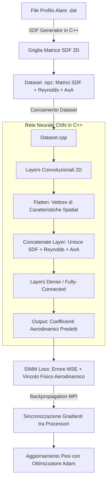

# 🛩️ Guida Passo-Passo alla Comprensione del Progetto
## *Modello di Accelerazione/Aerodinamica del Ghiaccio su Alaa di Aereo (IA + Fisica)*

> **Benvenuto!** Se non conosci questo progetto e la materia ti sembra complessa o ricca di termini tecnici (fluidodinamica, reti neurali, C++, MPI), **sei nel posto giusto**. 
> Questa guida è stata creata appositamente per spiegarti ogni singolo concetto **da zero**, con un linguaggio semplice, analogie intuitive e una struttura passo-passo.

---

## 🧭 Indice dei Contenuti
1. [Il Problema Reale (Perché esiste questo progetto?)](#1-il-problema-reale-perché-esiste-questo-progetto)
2. [I Concetti Chiave Spiegati in Modo Semplice](#2-i-concetti-chiave-spiegati-in-modo-semplice)
3. [Perché il Codice è Speciale? (C++ e HPC da Zero)](#3-perché-il-codice-è-speciale-c-e-hpc-da-zero)
4. [Mappa e Struttura della Repository](#4-mappa-e-struttura-della-repository)
5. [Come Funziona la Pipeline (Il Flusso Passo-Passo)](#5-come-funziona-la-pipeline-il-flusso-passo-passo)
6. [Glossario dei Termini Tecnici](#6-glossario-dei-termini-tecnici)
7. [Guida Pratica per Esplorare il Codice](#7-guida-pratica-per-esplorare-il-codice)

---

## 1. 🎯 Il Problema Reale (Perché esiste questo progetto?)

### Il Contesto Aerodinamico
Quando un aereo vola, le sue ali fendono l'aria generandone due forze fondamentali:
* **Portanza ($C_L$ - Lift):** La forza diretta verso l'alto che tiene l'aereo in volo.
* **Resistenza ($C_D$ - Drag):** La forza che frena l'aereo (l'attrito con l'aria).

Se sull'ala si forma del **ghiaccio**, la sua forma geometrica cambia leggermente. Questo modifica il modo in cui l'aria scorre attorno ad essa, riducendo la portanza e aumentando la resistenza.

### La Sfida Tradizionale (CFD)
Per calcolare esattamente la portanza e la resistenza di una determinata forma geometrica dell'ala, gli ingegneri usano la **CFD (Computational Fluid Dynamics)**, ovvero simulazioni al computer che risolvono equazioni matematiche complesse (equazioni di Navier-Stokes).
* ❌ **Problema della CFD:** È **lentissima**. Una singola simulazione per una sola forma d'ala può richiedere ore o persino giorni di calcolo su supercomputer.

### La Soluzione del Progetto: Un "Modello Surrogato" con IA
L'obiettivo di questa repository è sostituire la lenta simulazione CFD con una **Rete Neurale Artificiale (Intelligenza Artificiale)**.
* ✅ **Vantaggio dell'IA:** Una volta addestrata sui dati di passate simulazioni CFD, la rete neurale è in grado di calcolare i coefficienti aerodinamici ($C_L, C_D$) in **pochi millisecondi**!

```
[Forma Ala 2D] + [Condizioni di Volo]
       │
       ▼
 🤖 RETE NEURALE (CNN in C++) ──(Frazione di secondo)──► [Portanza e Resistenza Predict]
```

---

## 2. 🧩 I Concetti Chiave Spiegati in Modo Semplice

Per capire il codice, devi conoscere solo 4 mattoncini fondamentali:

### A. Il Profilo Alare (Airfoil)
Se tagli un'ala di aereo a metà e la guardi di lato, vedi una forma a goccia allungata. Questo è il **profilo alare**. Nel progetto, la forma del profilo è memorizzata inizialmente come una lista di coordinate 2D ($x, z$) in file `.dat`.

### B. La Signed Distance Function (SDF)
Le reti neurali convoluzionali (CNN) lavorano benissimo con le **immagini** (griglie di pixel 2D). Ma le coordinate di un'ala sono solo una linea di punti!
Come "mostrare" la forma dell'ala all'IA?
Usiamo la **SDF**:
1. Immagina di sovrapporre una griglia scacchiera 2D al profilo alare.
2. In ogni quadratino della griglia, calcoliamo la distanza dal bordo dell'ala:
   * Se il punto si trova **fuori** dall'ala, la distanza è **positiva (+)**.
   * Se il punto si trova **dentro** l'ala, la distanza è **negativa (-)**.
   * Se il punto si trova sul bordo, la distanza è **0**.

In questo modo, la forma geometrica dell'ala diventa un'**immagine digitale** che la rete neurale può analizzare facilmente!

### C. I Parametri di Volo (Reynolds e AoA)
Oltre alla forma dell'ala, per calcolare le forze aerodinamiche l'IA ha bisogno di 2 valori scalari:
1. **Numero di Reynolds ($Re$):** Un numero che indica le condizioni del flusso d'aria (velocità, viscosità dell'aria, densità).
2. **Angolo di Attacco ($\text{AoA}$ - Angle of Attack):** L'inclinazione dell'ala rispetto alla direzione del vento. (Se l'ala è inclinata verso l'alto, la portanza aumenta... fino a uno stallo!).

### D. La Fisica nell'Intelligenza Artificiale (SIMM Loss)
Una rete neurale standard impara semplicemente a "memorizzare" o approssimare i numeri del dataset (minimizzando l'errore quadratico medio, MSE). Tuttavia, se i dati hanno rumore, l'IA potrebbe inventare risultati biologicamente o fisicamente impossibili!

In questo progetto è stata implementata la **SIMM Loss** (Physics-Informed Loss):
* L'IA viene premiata se indovina i numeri giusti (MSE).
* Ma viene **penalizzata** se viola le leggi della fisica aerodinamica! Ad esempio, la fisica ci dice che a piccoli angoli d'attacco, la portanza **deve crescere in modo strettamente lineare** con l'angolo d'attacco ($\text{Portanza} \propto \text{AoA}$). La SIMM Loss forza la rete neurale a rispettare questo vincolo fisico.

---

## 3. ⚡ Perché il Codice è Speciale? (C++ e HPC da Zero)

La maggior parte dei progetti di IA usa librerie Python già pronte come PyTorch o TensorFlow. 
**Questo progetto fa qualcosa di unico e avanzato:**

1. **Scritto interamente in C++20 da zero:**
   I layer (Convoluzione 2D, Dense, LeakyReLU, Activation, Concatenation), i Tensori, l'algoritmo di Backpropagation e l'ottimizzatore Adam sono stati **programmati a mano** in C++.
2. **Parallelismo MPI per Supercomputer (HPC):**
   Usa **MPI (Message Passing Interface)** per distribuire il carico di addestramento su centinaia di core/nodi di calcolo contemporaneamente (ad esempio sul supercomputer **Leonardo di CINECA**). Ogni processore calcola una parte dei dati e poi sincronizza i gradienti con gli altri.

---

## 4. 🗺️ Mappe e Struttura della Repository

La cartella di lavoro è organizzata principalmente in due moduli distinti:

```text
Ice_acceleration_model_on_airplane_wing_NAML/
│
├── SDF/                        # 📐 MODULO 1: Generatore della Signed Distance Function
│   ├── main.cpp                # Punto d'ingresso per convertire file .dat in matrici SDF
│   ├── SDFGenerator.cpp/.hpp   # Algoritmo che calcola le distanze dal bordo dell'ala
│   └── data/                   # Cartella contenente i file dei profili alari (.dat)
│
├── CNN/                        # 🧠 MODULO 2: La Rete Neurale in C++ / MPI
│   ├── main.cpp                # Punto d'ingresso per addestrare e testare il modello
│   ├── CMakeLists.txt          # Script per compilare il progetto C++
│   └── src/
│       ├── core/               # Gestione Tensori e Funzione di Loss Fisica (SIMM Loss)
│       ├── data/               # Caricamento del Dataset in formato .npz (NumPy C-API/Parser)
│       ├── layers/             # Tutti i livelli neurali (Conv2D, Dense, Activation, ecc.)
│       ├── model/              # Struttura del Modello (CNNModel) e salvataggio pesi
│       ├── optimizers/         # Algoritmo di ottimizzazione Adam
│       ├── training/           # Ciclo di addestramento (Trainer)
│       └── tuning/             # Cross-Validation ed esplorazione iperparametri
│
├── dataset/                    # 📦 Dataset con le matrici SDF e i coefficienti aerodinamici (.npz)
├── assets/                     # Immagini dell'architettura e delle prestazioni
├── README.md                   # Documentazione di sistema principale
└── cross_validation.md         # Guida dettagliata al Tuning degli iperparametri
```

---

## 5. 🔄 Come Funziona la Pipeline (Il Flusso Passo-Passo)

Ecco cosa succede dall'inizio alla fine quando il progetto viene eseguito:



### I Passi nel Dettaglio:

1. **Passo 1: Generazione SDF (`SDF/`)**
   I profili alari (file `.dat`) vengono letti. Il codice `SDFGenerator` calcola la griglia 2D di distanze e salva le matrici risultanti.
2. **Passo 2: Preparazione del Dataset (`dataset/`)**
   Le matrici SDF vengono unite ai parametri di volo ($\text{Reynolds}, \text{AoA}$) e ai valori reali di Portanza/Resistenza derivati da simulazioni CFD passate, salvando il tutto in file `.npz`.
3. **Passo 3: Passaggio In Avanti (Forward Pass)**
   * La matrice SDF 2D entra nei livelli convoluzionali (`Conv2DLayer`) per estrarre la forma geometrica dell'ala.
   * L'output viene appiattito (`FlattenLayer`).
   * Il livello `ConcatenateLayer` incolla insieme le caratteristiche geometriche estratte con i due numeri scalari di volo ($\text{Reynolds}$ e $\text{AoA}$).
   * I livelli `DenseLayer` elaborano queste informazioni combinate per generare la stima finale.
4. **Passo 4: Valutazione della Loss Fisica (SIMM Loss)**
   La funzione `Loss.cpp` confronta la stima con il valore reale e calcola la penalità fisica.
5. **Passo 5: Backpropagation e MPI**
   I gradienti dell'errore vengono calcolati all'indietro lungo la rete. Se si usano più processori tramite MPI, i gradienti vengono mediati tra tutti i nodi (`MPI_Allreduce`).
6. **Passo 6: Aggiornamento dei Pesi**
   L'ottimizzatore `AdamOptimizer` aggiorna i parametri della rete per migliorare le predizioni future.

---

## 6. 📖 Glossario dei Termini Tecnici

| Termine | Spiegazione Semplice |
| :--- | :--- |
| **Airfoil (Profilo Alare)** | La sagoma 2D della sezione trasversale di un'ala di aereo. |
| **CFD (Computational Fluid Dynamics)** | Simulazione numerica classica per calcolare il comportamento dell'aria attorno all'ala. Molto accurata ma lenta. |
| **Modello Surrogato (Surrogate Model)** | Un modello basato su IA che sostituisce una simulazione fisica lenta con calcoli quasi istantanei. |
| **SDF (Signed Distance Function)** | Un modo per trasformare una forma geometrica in una griglia di numeri (distanza dal bordo, positiva fuori, negativa dentro). |
| **Portanza ($C_L$)** | Coefficiente aerodinamico che spinge l'ala verso l'alto. |
| **Resistenza ($C_D$)** | Coefficiente aerodinamico che frena l'ala per attrito. |
| **AoA (Angle of Attack)** | Angolo d'attacco: l'inclinazione dell'ala rispetto al flusso d'aria. |
| **Numero di Reynolds ($Re$)** | Parametro che descrive il regime di scorrimento del fluido (aria). |
| **CNN (Convolutional Neural Network)** | Tipo di rete neurale particolarmente adatta a elaborare matrici e griglie spaziali/immagini. |
| **PINN / SIMM Loss** | Rete neurale o funzione di perdita informata dalla fisica: garantisce che le stime dell'IA rispettino le leggi della natura. |
| **MPI (Message Passing Interface)** | Standard per la programmazione parallela che permette a più computer o processori di lavorare insieme. |
| **Cross-Validation (Validazione Crociata)** | Tecnica per testare la rete neurale dividendo i dati in più parti (folds) per assicurarsi che non stia memorizzando a memoria i dati. |

---

## 7. 🚀 Guida Pratica per Esplorare il Codice

Se vuoi iniziare a leggere i file del codice, ecco l'ordine consigliato per non perderti:

1. 📄 **`README.md`**: Leggi la panoramica generale (ora che conosci i concetti di base sarà chiarissimo!).
2. 📐 **`SDF/SDFGenerator.hpp` e `SDF/main.cpp`**: Guarda come viene calcolata la griglia di distanze a partire dalle coordinate dell'ala.
3. 🧠 **`CNN/src/core/Tensor.hpp`**: Scopri come è implementata la struttura dati fondamentale che contiene le matrici e i relativi gradienti.
4. 🧱 **`CNN/src/layers/Layer.hpp` e `Conv2DLayer.cpp`**: Osserva come sono realizzati i vari componenti della rete neurale.
5. ⚖️ **`CNN/src/core/Loss.cpp`**: Guarda come è stata programmata matematicamente la **SIMM Loss** per unire Errore MSE e Fisica.
6. 🏁 **`CNN/main.cpp`**: Il punto principale in cui tutti i pezzi vengono assemblati, addestrati e testati!

---

💡 *Consiglio: Puoi tenere aperto questo file `.md` nella tua schermata di lavoro su VS Code in modalità Anteprima (Preview) per consultarlo ogni volta che trovi un termine o una cartella che non ricordi!*
