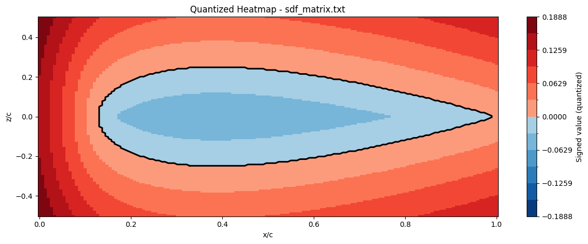
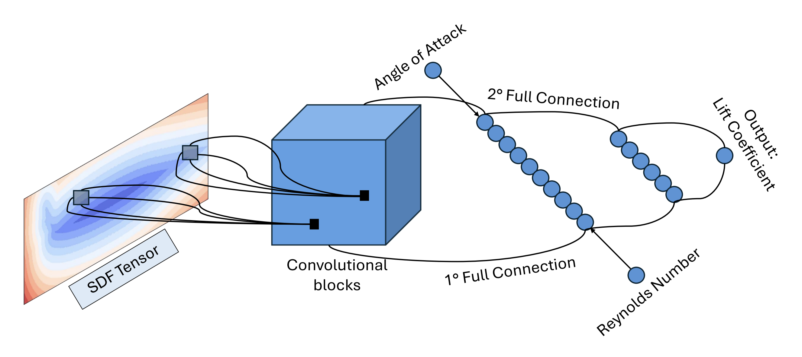

# Ice Acceleration Model on Airplane Wing

This project reproduces the CNN-based approach from the AMSC Project paper for predicting aerodynamic coefficients on airfoil profiles. The core idea is to replace traditional CFD simulations with a data-driven surrogate model: given the airfoil geometry (encoded as a Signed Distance Function) and flight conditions (Reynolds number and Angle of Attack), the model predicts the resulting aerodynamic forces.

Unlike a standard purely data-driven neural network, this implementation adopts a **physics-informed cost function** (SIMM loss). The loss combines a standard MSE term on the predicted coefficients with a physics-based regularization term that enforces the known linear relationship between the lift coefficient and the angle of attack in the small-angle regime. This physical prior acts as a soft constraint, guiding the model toward physically consistent predictions and improving generalization.

The pipeline is composed of two main modules:
- **SDF Generator** — converts raw airfoil boundary coordinates into a grid-based Signed Distance Function representation.
- **CNN Model** — a custom C++/MPI CNN framework built from scratch, performing manual forward/backward passes with distributed gradient averaging via MPI.



---

## Repository Structure

```text
.
├── README.md
├── assets/
│   ├── SDF.png
│   ├── cnn_architecture.png
│   └── training trend.png
├── SDF/                          # SDF Generator subproject
│   ├── main.cpp
│   ├── SDFGenerator.cpp
│   ├── SDFGenerator.hpp
│   ├── visualization.ipynb
│   └── data/
├── CNN/                          # CNN Model subproject
│   ├── CMakeLists.txt
│   ├── main.cpp
│   ├── tests/
│   │   └── test_cross_validation.cpp
│   └── src/
│       ├── core/
│       │   ├── Loss.cpp / Loss.hpp
│       │   └── Tensor.cpp / Tensor.hpp
│       ├── data/
│       │   └── Dataset.cpp / Dataset.hpp
│       ├── layers/
│       │   ├── ActivationLayer.cpp / .hpp
│       │   ├── ConcatenateLayer.cpp / .hpp
│       │   ├── Conv2DLayer.cpp / .hpp
│       │   ├── DenseLayer.cpp / .hpp
│       │   ├── FlattenLayer.cpp / .hpp
│       │   ├── Layer.hpp
│       │   ├── LeakyReLULayer.cpp / .hpp
│       │   ├── ReLULayer.cpp / .hpp
│       │   ├── SigmoidLayer.cpp / .hpp
│       │   └── TanhLayer.cpp / .hpp
│       ├── model/
│       │   ├── CNNModel.cpp / CNNModel.hpp
│       │   └── ModelFactory.cpp / ModelFactory.hpp
│       ├── optimizers/
│       │   ├── AdamOptimizer.cpp / .hpp
│       │   └── Optimizer.hpp
│       ├── training/
│       │   └── Trainer.cpp / Trainer.hpp
│       └── tuning/
│           ├── CrossValidator.cpp / .hpp
│           ├── SearchSpace.hpp
│           └── TrialConfig.cpp / .hpp
├── docs/
│   ├── cross_validation.md         # Tuning architecture and extension guide
│   └── training_diagnostics_plots.md # Meaning of generated diagnostic plots
└── dataset/                      # Dataset directory (created at setup)
```

---

## SDF Generator

The SDF Generator reads airfoil boundary coordinates from `.dat` files and computes a Signed Distance Function on a fixed-size grid. The output is saved as a text matrix.

### Prerequisites

- C++ compiler supporting C++17
- MPI library for parallel processing

### Data Format

Input files are `.dat` files containing whitespace-separated `x` and `z` coordinates per line.

### Compilation

```bash
cd SDF
mpic++ main.cpp SDFGenerator.cpp -o sdfgen -std=c++17
```

### How to Run

1. Create a `data` directory in the same location as the compiled `sdfgen` executable.
2. Place your airfoil `.dat` files (e.g., `n0012.dat`) inside the `data` directory.
3. Execute with `mpirun`:

```bash
mpirun -np 4 ./sdfgen
```

### Output

For each input `.dat` file (e.g., `airfoil.dat`), a corresponding SDF matrix file is generated as `airfoil_matrix.txt`. This file contains SDF grid values in space-separated matrix format: positive values are outside the airfoil, negative values are inside.

---

## CNN Model

The CNN model is a custom C++ Convolutional Neural Network framework built from scratch. It performs manual forward/backward passes, distributed gradient averaging using MPI, and trains a regression model to predict aerodynamic coefficients from SDF matrices and scalar features (Reynolds number, Angle of Attack).

The architecture consists of:

- **2D Convolution** (1→8 channels, kernel 5x5, stride 5)
- **LeakyReLU** activation (ReLU, Tanh and Sigmoid are also available via the shared `ActivationLayer` base class)
- **Flatten** layer
- **Concatenate** layer (merging conv features with Reynolds and AoA scalars)
- **Dense** layers (128 → 64 → 1 in the baseline)

The architecture is now constructed from typed layer recipes with automatic shape inference. `CrossValidator` can evaluate typed candidate configurations for kernels, channels, activations, dense topology, optimizer settings, and developer-provided components without adding parameter-specific methods. See [docs/cross_validation.md](docs/cross_validation.md).

The loss function is a physics-informed **SIMM loss** combining MSE on predictions with a physics term that enforces the relationship between predicted coefficients and the angle of attack for small angles.



### Prerequisites

- C++ compiler supporting C++20
- MPI library for parallel processing
- Python 3 and NumPy (`pip install numpy`) for decoding `.npz` dataset files natively

### Data Format

Input files are `.npz` files containing SDF matrices, scalar features ordered as `[Reynolds, AoA in degrees]`, and target labels. Place dataset files (`cnn_dataset_train.npz`, `cnn_dataset_test.npz`) in a `dataset/` directory at the repository root.

Download the dataset from Kaggle:
[SDF Symmetric Airfoil High Reynolds Number](https://www.kaggle.com/datasets/giulioenzodonninelli/sdf-symmetric-airfoil-high-reynolds-number)

```bash
mkdir -p dataset
kaggle datasets download -d giulioenzodonninelli/sdf-symmetric-airfoil-high-reynolds-number -p dataset --unzip
```

### Compilation

```bash
cd CNN
mpicxx -std=c++20 -O3 -Isrc main.cpp src/core/*.cpp src/data/*.cpp src/layers/*.cpp src/model/*.cpp src/optimizers/*.cpp src/training/*.cpp src/tuning/*.cpp -o cnn_executable
```

Alternatively, from the repository root, use CMake and CTest:

```bash
cmake -S CNN -B build/CNN -DCMAKE_BUILD_TYPE=Release
cmake --build build/CNN --parallel
ctest --test-dir build/CNN --output-on-failure
```

### How to Run

From the repository root:

```bash
mpirun -n 4 ./CNN/cnn_executable
```

The activation function can be selected from the command line (default: `leakyrelu`):

```bash
mpirun -n 4 ./CNN/cnn_executable --activation tanh
mpirun -n 4 ./CNN/cnn_executable --activation leakyrelu --alpha 0.1
```

Valid activations are `leakyrelu`, `relu`, `tanh` and `sigmoid`; `--alpha` sets the negative slope and only affects `leakyrelu`.

Training parameters are available from the command line:

```bash
mpirun -n 4 ./CNN/cnn_executable --epochs 100 --batch-size 256 --learning-rate 1e-5
```

Run deterministic random K-fold evaluation for the configured model:

```bash
mpirun -n 4 ./CNN/cnn_executable --cross-validate --folds 5 --epochs 100 --batch-size 256 --seed 42
```

The global batch size is independent of MPI rank count. Fold normalization is fitted from training samples only, the test NPZ remains untouched until cross-validation is complete, and scoring uses physical-unit validation MSE. Developers can pass a typed `ParameterGrid` to `CrossValidator::tune()` when comparing configurations.

### Output

Ordinary/final training prints one compact line per epoch by default. Final training validates every epoch unless `--validation-interval` is provided. Cross-validation remains concise and validates every 10 epochs by default, then reports the final fold scores, aggregate mean and deviation, and final untouched-test MSE. The test NPZ is not loaded until cross-validation has completed.

### Training Diagnostics

Diagnostics are optional and do not change model updates, weighted MPI gradient synchronization, fold normalization, or physical-MSE candidate selection. Enable them with a configurable output location:

```bash
mpirun -n 4 ./build/CNN/cnn_executable \
  --diagnostics \
  --results-dir results \
  --experiment baseline \
  --run-name seed_42 \
  --epochs 100 \
  --validation-interval 1 \
  --histogram-bins 64
```

Relevant options are `--diagnostics`, `--no-diagnostics`, `--results-dir`, `--experiment`, `--run-name`, `--validation-interval`, `--histogram-bins`, `--verbose-final`, and `--quiet-final`. Diagnostics are disabled by default. CV defaults to a validation interval of 10; final training defaults to 1. A non-checkpoint epoch stores an empty validation-MSE field rather than carrying a previous value forward.

Each run writes:

```text
results/<experiment>/<run>/
  metadata.json
  epoch_metrics.csv
  gradient_norms.csv
  parameter_update_ratios.csv
  activation_statistics.csv
  activation_histograms.csv
  learning_rate_steps.csv           # populated for scheduled optimizers
  cv_summary.csv                    # CV sessions
  candidate_000/fold_000/...       # per-candidate/fold artifacts
  final/...                         # final fit after CV
  plots/
```

Candidate and fold directory names are numeric and zero-based. User-facing candidate names and selected parameters remain in metadata. Experiment and run path components are sanitized; their original values remain in `metadata.json`.

Metrics and recording policy:

- `epoch_metrics.csv` stores epoch, sample-weighted SIMM training objective, physical-unit validation MSE or a missing field, globally processed samples, global optimizer steps/batches, and configured/effective learning rates.
- `gradient_norms.csv` measures synchronized global gradients before element-wise clipping and Adam. `all` combines weights and biases for each trainable layer; separate parameter scopes are also emitted. Mean, RMS, maximum, and last L2 norm aggregate every global optimizer step in the epoch. Depth plots use RMS.
- `parameter_update_ratios.csv` measures the actual Adam delta around the real optimizer call: `||after-before||_2 / max(||before||_2, 1e-12)`. It therefore includes clipping, Adam moments, coupled weight decay, and every optimizer behavior. Pre-update norm, update norm, ratio aggregates, and near-zero denominator counts are stored.
- `activation_statistics.csv` stores exact streaming count, mean, population variance, minimum, and maximum for the tensor entering and returned by each `ActivationLayer`. Rows explicitly use `pre_activation` and `post_activation`; Flatten and Concatenate are not treated as activations.
- `activation_histograms.csv` stores fixed, bounded histograms over `[-10, 10]`. Values outside that range are counted in the edge bins. Bin edges are identical across epochs, histogram counts cover the full population, and no raw activation tensors are retained.
- `metadata.json` stores mode, names, candidate/fold identity, selected parameters, seeds, model order, optimizer/Adam settings, clipping, batch/epoch settings, dataset paths, MPI size, histogram policy, and the build-time Git revision when available.
- `learning_rate_steps.csv` stores exact per-step effective rates when an optimizer reports that it uses a schedule. Current Adam has a constant rate, so epoch-level configured/effective values are sufficient and this file contains only its header.

Activation values are collected from the existing training forward pass only. Gradient and update metrics are computed after every synchronized optimizer step and retained only as epoch aggregates. Activation moments and histograms are accumulated during the epoch and persisted once per epoch.

MPI activation counts, sums, squared sums, minima, maxima, and histogram counts use matching `MPI_Allreduce` operations at epoch boundaries. Gradient diagnostics inspect the already synchronized weighted global gradient. Since all ranks apply the same optimizer update, rank zero measures the true update on its replicated parameters and is the only rank that writes files or verbose diagnostics. Serial and two-rank tests use a `1e-5` training-equivalence tolerance; diagnostic counts and histogram populations are expected to match exactly.

Generate plots without a display server:

```bash
python3 CNN/analysis/plot_training_diagnostics.py \
  --input results/<experiment>/<run> \
  --output-dir results/<experiment>/<run>/plots
```

See [docs/training_diagnostics_plots.md](docs/training_diagnostics_plots.md) for an explanation of every generated plot, axis, metric, and common interpretation warning.

Use repeatable `--candidate`, `--fold`, and `--epoch` selectors as needed. The script uses only NumPy, Matplotlib, and Python's standard library, writes under the selected run, uses logarithmic scaling safely for zero gradient/update values, and keeps incompatible candidate topologies in separate CV comparison plots.


---

## CINECA Leonardo Cluster Deployment

This section describes how to download, compile, and run the CNN model on the CINECA Leonardo cluster.

### 1. Downloading & Syncing

**Option A: Clone directly on the cluster (recommended)**

```bash
cd ~
git clone https://github.com/AleVerri-03/Ice_acceleration_model_on_airplane_wing.git
cd Ice_acceleration_model_on_airplane_wing
```

**Option B: Sync local changes via rsync (from local terminal)**

```bash
rsync -avz ./CNN <username>@login.leonardo.cineca.it:~/
```

### 2. Dataset Setup

Symlink the dataset directory on Leonardo to avoid duplicating large files:

```bash
cd /leonardo/home/userexternal/<username>/Ice_acceleration_model_on_airplane_wing/CNN
ln -s ../dataset ./dataset
```

### 3. Environment Setup & Compilation

Load the required modules and compile on the **login node**:

```bash
module purge
module load python/3.11.7
module load gcc/11.3.0
module load intel-oneapi-compilers
module load intel-oneapi-mpi

mpicxx -cxx=g++ -std=c++20 -O3 -static-libstdc++ -Isrc main.cpp src/core/*.cpp src/data/*.cpp src/layers/*.cpp src/model/*.cpp src/optimizers/*.cpp src/training/*.cpp src/tuning/*.cpp -o cnn_mpi_executable
```

### 4. Submitting Slurm Jobs

Create a job script `run_cnn.sh`:

```bash
#!/bin/bash
#SBATCH --job-name=cnn_training
#SBATCH --account=<project_account>
#SBATCH --partition=dcgp_usr_prod
#SBATCH --nodes=1
#SBATCH --ntasks-per-node=1
#SBATCH --cpus-per-task=112
#SBATCH --time=01:00:00
#SBATCH --output=cnn_%j.out
#SBATCH --error=cnn_%j.err

cd /leonardo/home/userexternal/<username>/Ice_acceleration_model_on_airplane_wing/CNN

module purge
module load python/3.11.7
module load gcc/11.3.0
module load intel-oneapi-compilers
module load intel-oneapi-mpi

srun ./cnn_mpi_executable
```

Submit and monitor:

```bash
sbatch run_cnn.sh        # Submit
squeue -u <username>     # Check status
tail -f cnn_*.out        # Live output
cat cnn_*.err            # Check errors
scancel <JOB_ID>         # Cancel job
```

### 5. Budget & Storage

- **Check budget:** `saldo -u <username> -b --dcgp`
- **Cost formula:** `Nodes × Cores × Hours` (e.g., 1 node × 64 cores × 1h = 64 core-hours)
- **Storage:** `$HOME` has strict quotas; move large files to `$SCRATCH` if needed.
